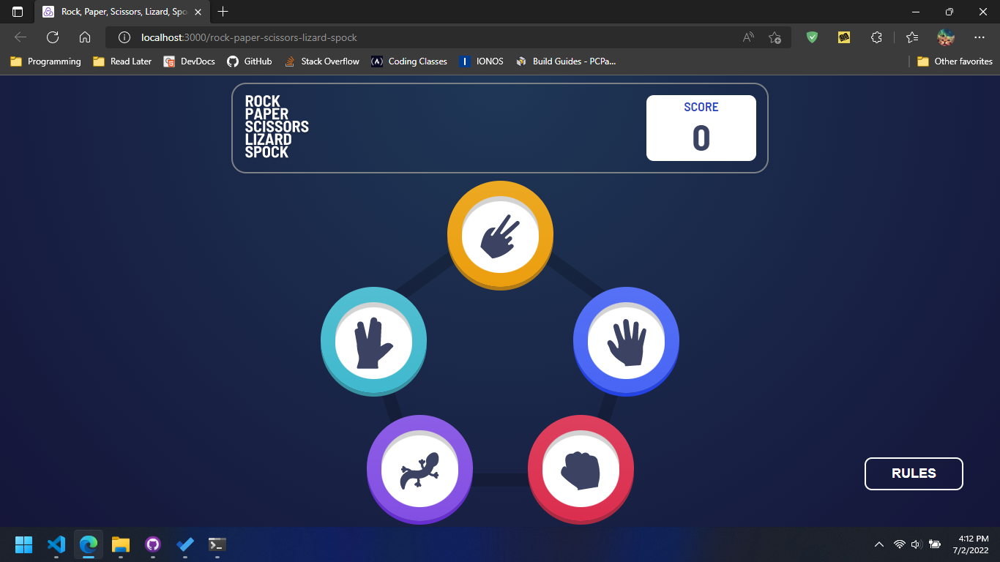

# Frontend Mentor - Rock, Paper, Scissors solution

This is a solution to the [Rock, Paper, Scissors challenge on Frontend Mentor](https://www.frontendmentor.io/challenges/rock-paper-scissors-game-pTgwgvgH). Frontend Mentor challenges help you improve your coding skills by building realistic projects. 

## Table of contents

- [Overview](#overview)
  - [The challenge](#the-challenge)
  - [Screenshot](#screenshot)
  - [Links](#links)
- [Built with](#built-with)

**Note: Delete this note and update the table of contents based on what sections you keep.**

## Overview

### The challenge

Users should be able to:

- View the optimal layout for the game depending on their device's screen size
- Play Rock, Paper, Scissors against the computer
- Maintain the state of the score after refreshing the browser _(optional)_
- **Bonus**: Play Rock, Paper, Scissors, Lizard, Spock against the computer _(optional)_

### Screenshot

### Links

- Solution URL: [https://www.frontendmentor.io/solutions/rock-paper-scissors-using-react-1yTXRnayaY](https://www.frontendmentor.io/solutions/rock-paper-scissors-using-react-1yTXRnayaY)
- Live Site URL: [https://hazipan.github.io/rock-paper-scissors-lizard-spock/](https://hazipan.github.io/rock-paper-scissors-lizard-spock/)

## Built with

- Flexbox
- [React](https://reactjs.org/) - JS library